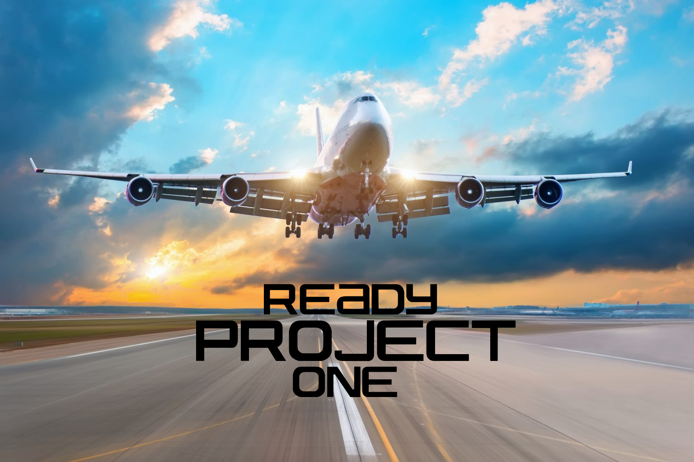
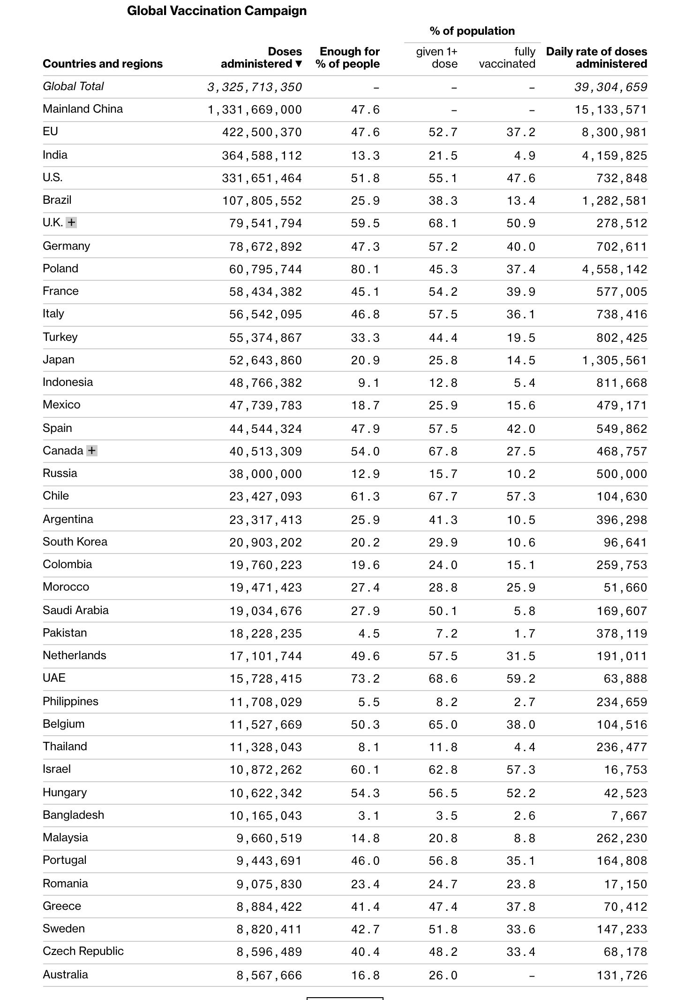
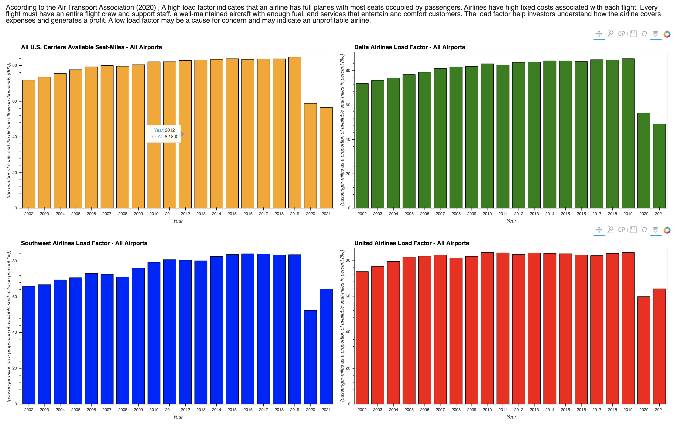
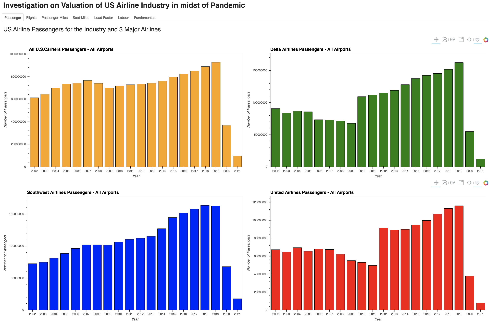

# **Investigation on Valuation of  US Airline Industry in midst of Pandemic**

---
## **Background**
The airline industry was devastated by the Covid 19 pandemic. According to the Mckinsey Report, airline sector sales in 2020 was  about 40% of previous year, and in nominal terms same as in 2000. It has been projected that air traffic won’t return to 2019 levels before 2024.

There has been a substantial drop in demand for air travel as a result of travel restrictions and lockdowns. As a result of the decrease in passenger traffic, flights have been cancelled or planes have flown at reduced capacity. Airlines are required to issue refunds for cancelled flights under US Department of Transportation regulations, where as Airlines in other countries have refunded through travel vouchers.

On the other side, as passenger planes have been cancelled, the cost of shipping cargo has skyrocked. According to NY times article, cost of sending cargo across the Pacific Ocean tripled by late March 2020.  At the end of March 2020, cargo capacity was down by 35% compared to the previous year.

US Government had earmarked more than $50 Billion out of the Covid Relief Package for US airline payroll support. 

According to Bloomberg Covid Vaccine Tracker, as of July 07 2021, around 3.32 billion doses have been administered across 180 countries. In US, 332 million doses have given so far ie approx 51.8% population coverage.  While vaccines have proven to provide some kind of protection, it would take coordinated campaign to stop the pandemic and life to return to normal.

(Source: Bloomberg.com)

Meanwhile, the airline stock are telling a different story.
The initial reaction of stock market to pandemic was drastic correction in prices of airline stocks.  By the end of 2021, the prices of airline stock has recovered to pre-pandemic levels.

(Source: Investing.com)

---
## **Objective**
To investigate the stock prices of airlines industry and comment on the valuation of the industry

---
## **Collaborators**
* [Ethol Palmer](https://github.com/etholpalmer)
* [Ashweej Shenoy](https://github.com/ashweej18)
* [John Mari Mangahas](https://github.com/adobopeanuts)
* [Monique Rowe](https://github.com/moniquerowe15)

---
## **Steps**
To investigate into prices of stocks in airline industry, we have chosen top 3 stocks based on the market capitalization from NYSE ARCA Airline Index (NYSE: [XAL](https://www.nyse.com/quote/index/XAL)) as proxy. 

* Southwest Airlines(NYSE:LUV)
* Delta Airlines (NYSE:DAL)
* United Airlines (NYSE:UAL)

**Step 1:** Data Clearning & Manipulation

1. Collect stock prices of the airline stock for from 2011 to 2021.
2. Get Fundamentals for airline stock from their published quarterly income and balance sheet through API calls
3. Combine the stock price data along with the fundamental data 
4. Calculate the Income Statement ratios - Gross Profit Margin, Operating Margin, Net Profit Margin to analyze the changes in values over times
5. Calculate the Balance Sheet Ratios -Debt to Equity Ratio, Quick Ratio, Current Ratio, Interest Coverage Ratio 
6. Calculate Valuation Ratios -P/E, P/B and P/S and also calculate ROE and understand how the ratios changed over time.
7. Collect the airline industry data for Passenger Data, Flight Data, Passenger-Miles Data , Revenue Seat-Miles Data, Load Factor Data and clean the data
8. Get the Employee Data, Revenue Mix data to analyze the trends in the data
9. Write the cleaned data into CSV files to be used for visualization

**Step 2** Data Visualization
1. Load the cleaned Data from step 1 into Pandas Data frame
2. Create visualization for ratios, stock prices and industry statistics using Matplotlib, Plotly Express and Holoviz
3. Using the Panel library build an interactive dashboard for all of the visualizations

---
## **Technologies/Tools/Libraries**
1. Python
2. Pandas
3. Matplotlib
4. Panel
5. Holoviz
6. Plotly
7. Pyviz
8. Alapaca Market API
9. SIMFIN API
10. Jupyter Notebook

---
## **Data**
* Stock Price Data from Alpaca API
* Balance Sheet and Income Statement Data are sourced from SIMFIN API and [StockAnalysis](https://stockanalysis.com/) website
* Air Traffic, Passengar Data, Load Factor, Seal Miles data sourced from [Bureau of Transporation Statistics](https://www.bts.gov/)

---
## **Code**
* [Airline Consolidated](Airline_Consolidated.ipynb)
* [Airline Industry Statistics](Airline_Industry_Stats.ipynb)
* [Dashboard](Airline_Dashboard.ipynb)

---
## **Output**

1. **Passengers**

2. **Flights**

3. **Passenger Miles**

3. **Seat Miles**

4. **Load Factor**

5. **Labour**

6. **Financials**

7. **Dashboard**

---
## **Conclusion**

---
## **References**
* [Mckinsey Report on Airline Industry](https://www.mckinsey.com/industries/travel-logistics-and-infrastructure/our-insights/back-to-the-future-airline-sector-poised-for-change-post-covid-19)
* [NY Times -  US Needs China Masks, as acrimony grows](https://www.nytimes.com/2020/03/23/business/coronavirus-china-masks.html)
* [Wikipedia - Impact of Covid 19 pandemic on Aviation ](https://en.wikipedia.org/wiki/Impact_of_the_COVID-19_pandemic_on_aviation#cite_note-The_U.S._needs_China's_masks-11)
* [NY Times -Obstacles & Opportunities for Aviation Industry](https://www.nytimes.com/2020/04/29/business/smallbusiness/aviation-coronovirus-impact.html)
* [NY Times -High Cost of Airline Bailout](https://www.nytimes.com/2021/03/17/business/dealbook/airline-bailouts-pandemic.html)
* [Bloomberg -Why Airline Bailout couldn't prevent Airport Chaos](https://www.bloomberg.com/opinion/articles/2021-06-22/u-s-airline-bailouts-can-t-prevent-airport-chaos)
* [Vox- Airline Bailouts ](https://www.vox.com/the-goods/2020/3/19/21186792/airline-bailouts-coronavirus-50-billion)
* [IATA Report - Airline Passenger Market Analysis](https://www.iata.org/en/iata-repository/publications/economic-reports/air-passenger-monthly-analysis---july-2020/)
* [IATA Report - Economic Performance of Airline Industry](https://www.iata.org/en/iata-repository/publications/economic-reports/airline-industry-economic-performance-june-2020-report/)
* [FRED - Data on Load Factor](https://fred.stlouisfed.org/series/LOADFACTOR)
* [Bureau of Transporation Statistics](https://www.bts.gov/)
* [Business Insider ](https://www.businessinsider.com/american-united-southwest-delta-cargo-sole-growth-area-2020-4)
* [Seeking Alpha - Delta Airlines](https://seekingalpha.com/article/4418622-delta-air-lines-is-pandemic-proven-to-be-global-leader)
* [Supplychain247 -AirCargo](https://www.supplychain247.com/article/no_swift_changes_for_air_cargo/air)
* [Investopedia](https://www.investopedia.com/)
* [Wikipedia](https://en.wikipedia.org/wiki/Main_Page)

